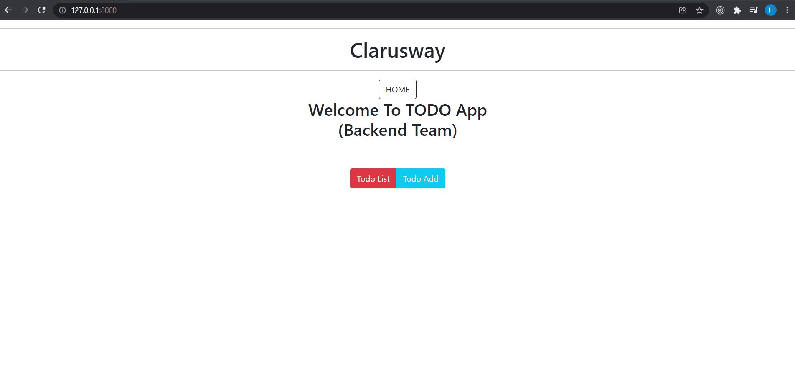

<!-- Please update value in the {}  -->

<h1 align="center">TODO App</h1>


<div align="center">
  <h3>
    <a href="http://hsynarslan.pythonanywhere.com/">
      Demo
    </a>
     | 
    <a href="http://hsynarslan.pythonanywhere.com/">
      Project
    </a>
 
  </h3>
</div>


<!-- TABLE OF CONTENTS -->

## Table of Contents

- [Overview](#overview)
- [Built With](#built-with)
- [Features](#features)
- [How to use](#how-to-use)
- [Acknowledgements](#acknowledgements)
- [Contact](#contact)

<!-- OVERVIEW -->

## Overview



### Built With

<!-- This section should list any major frameworks that you built your project using. Here are a few examples.-->

- HTML
- CSS
- Bootstrap
- Django

## How To Use

<!-- This is an example, please update according to your application -->

To clone and run this application, you'll need [Git](https://github.com/hsynarsln/Django-Todo-App.git) 
```bash
# Clone this repository
$ git clone https://github.com/aaron-clarusway/django_TODO_APPS.git

# Install dependencies
    $ python -m venv env
    > env/Scripts/activate (for win OS)
    $ source env/bin/activate (for macOs/linux OS)
    $ pip install -r requirements.txt

# Run the app
$ python manage.py runserver
```

## Acknowledgements
- Information for your projects

## Contact

- Email (hsyn06arslan@gmail.com)
- GitHub (https://github.com/hsynarsln)

- Linkedin (https://www.linkedin.com/in/huseyinarsln/)
